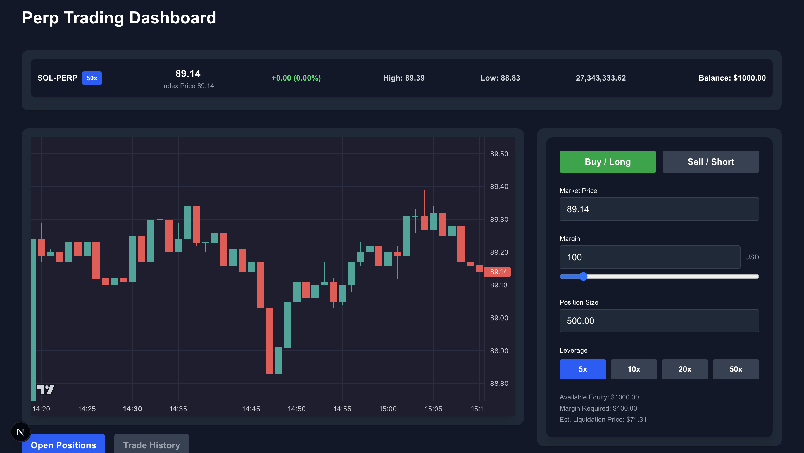

# 📈 Perp Engine

A full-stack, real-time perpetual futures trading platform. This project combines a high-performance **Rust** trading engine with a reactive **Next.js** dashboard to simulate a professional derivatives exchange.

---

## ✨ Project Overview

This platform is designed to handle the high-concurrency and high-precision requirements of financial trading. It features a custom-built risk engine that processes live market data from Binance to manage leveraged positions and liquidations.

### 🎥 Dashboard Preview



---

## 🏗 System Architecture

The project is split into specialized components to ensure low-latency data processing and a smooth user experience.

1. **Market Worker (Rust):**  
   An asynchronous worker that maintains a persistent WebSocket connection to Binance, streaming live SOL/USDT trades.

2. **Risk Engine (Rust):**  
   A state machine that utilizes fixed-point arithmetic (`rust_decimal`) to calculate PnL and trigger auto-liquidations.

3. **API Layer (Actix-Web):**  
   A thread-safe REST API that exposes engine state via protected shared memory.

4. **Trading Dashboard (Next.js):**  
   A professional-grade UI featuring real-time price charts and position management.

---

## ⚙️ Core Mechanics

- **Leveraged Trading:** Supports **5x–50x leverage** with real-time margin validation.
- **Auto-Liquidation:** Positions are automatically closed if the mark price hits the calculated liquidation threshold.
- **High Precision:** Zero floating-point errors using `Decimal` types for financial calculations.
- **Event-Driven:** Decoupled architecture using **MPSC channels** for non-blocking state updates.

---

## 🛠 Tech Stack

| Domain | Technology |
|------|-------------|
| **Backend** | Rust, Actix-Web, Tokio, WebSockets, rust_decimal |
| **Frontend** | Next.js, React, TypeScript, Tailwind CSS |
| **DevOps** | Docker (optional), Shell scripting for automated testing |

---

## 📂 Repository Structure

```text
perp-engine/
├─ backend/     # Rust trading engine & REST API
├─ frontend/    # Next.js trading dashboard
└─ README.md    # Project documentation
```

---

## 🚀 Running the Project

### 1. Start the Backend

```bash
cd backend
cargo run
```

The server will start on:

```
http://127.0.0.1:8080
```

The engine will begin streaming live prices.

---

### 2. Start the Frontend

```bash
cd frontend
npm install
npm run dev
```

Open:

```
http://localhost:3000
```

to access the trading dashboard.

---

## 🧪 Automated Testing

The backend includes a test script to verify the trading lifecycle.

```bash
cd backend
./test_engine.sh
```

